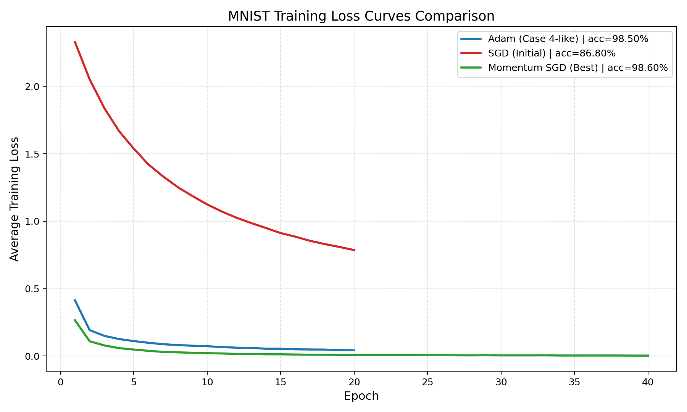

# MNIST 숫자 인식 과제 보고서

## 0. 반/조

| 항목 | 내용 |
| --- | --- |
| 반 | 예: AI 302반 |
| 조명 | 7조 |
| 조원 | 구름, 오기란, 이경근, 고윤서 |

---

## 1. 실험 목적

본 프로젝트는 PyTorch, TensorFlow 같은 딥러닝 프레임워크를 사용하지 않고, NumPy만으로 MNIST 손글씨 숫자 분류 신경망을 직접 구현하는 것을 목표로 하였다.  
또한 단순히 정확도를 얻는 것에 그치지 않고, `forward -> loss -> backward -> optimizer update`의 전체 학습 흐름을 직접 구현하고 이해하는 데 목적이 있다.

---

## 2. 모델 구조

본 프로젝트에서는 MNIST 숫자 분류를 위해 다층 퍼셉트론(MLP) 구조의 신경망을 사용하였다.  
입력 이미지는 `28 x 28` 크기의 흑백 이미지이며, 이를 1차원으로 펼친 `784`차원 벡터를 입력으로 사용하였다.

전체 모델 구조는 다음과 같다.

`784 -> Affine(512) -> BatchNorm -> ReLU -> Dropout -> Affine(256) -> BatchNorm -> ReLU -> Dropout -> Affine(10) -> Softmax`

| 구분 | 내용 |
| --- | --- |
| 입력층 | 784차원 (`28 x 28` 이미지를 펼친 벡터, `0~1` 정규화) |
| 은닉층 1 | `Affine(512) -> BatchNorm -> ReLU -> Dropout` |
| 은닉층 2 | `Affine(256) -> BatchNorm -> ReLU -> Dropout` |
| 출력층 | `Affine(10) -> Softmax` |

각 레이어의 역할은 다음과 같다.

- `Affine`: 입력에 가중치와 편향을 적용하는 완전연결층
- `BatchNorm`: 은닉층 출력 분포를 정규화해 학습을 안정화하는 층
- `ReLU`: 비선형성을 부여하는 활성화 함수
- `Dropout`: 일부 뉴런을 비활성화해 과적합을 줄이는 기법
- `Softmax`: 최종 점수를 클래스별 확률로 바꾸는 함수

---

## 3. 학습 설정

### 3-1. 기본 실험 설정

기본 실험에서는 Adam과 SGD를 비교하고, learning rate, dropout ratio, epoch 수에 따른 성능 변화를 확인하고자 했다.

| Case | Optimizer | Learning Rate | Dropout Ratio | Epochs | Batch Size | BatchNorm Momentum | Weight Init |
| --- | --- | ---: | ---: | ---: | ---: | ---: | --- |
| Case 1 | Adam | 0.001 | 0.2 | 15 | 128 | 0.9 | He (bias 0) |
| Case 2 | Adam | 0.0005 | 0.2 | 15 | 128 | 0.9 | He (bias 0) |
| Case 3 | Adam | 0.0001 | 0.3 | 15 | 128 | 0.9 | He (bias 0) |
| Case 4 | Adam | 0.001 | 0.5 | 20 | 128 | 0.9 | He (bias 0) |
| Case 5 | SGD | 0.001 | 0.5 | 20 | 128 | 0.9 | He (bias 0) |

### 3-2. 추가 실험: SGD 재탐색

기존 `Case 5`에서 SGD 성능이 낮게 나타났기 때문에, 같은 모델 구조를 유지한 채 SGD 계열의 하이퍼파라미터를 추가로 조정했다.  
추가 실험은 전체 MNIST 데이터셋을 기준으로 다시 수행했으며, 비교 일관성을 위해 `np.random.seed(42)`를 고정했다.
여기서 MSGD는 Momentum을 적용한 SGD이다.
Momentum 0.9는 이전 방향을 90% 반영한다는 뜻이다.

| Experiment | Optimizer | Learning Rate | Momentum | Dropout Ratio | Epochs | Batch Size |
| --- | --- | ---: | ---: | ---: | ---: | ---: |
| SGD-A | SGD | 0.001 | 0.0 | 0.5 | 20 | 128 |
| SGD-B | SGD | 0.01 | 0.0 | 0.3 | 40 | 128 |
| SGD-C | SGD | 0.05 | 0.0 | 0.3 | 40 | 128 |
| SGD-D | SGD | 0.05 | 0.0 | 0.1 | 60 | 128 |
| MSGD-A | SGD | 0.02 | 0.9 | 0.1 | 40 | 128 |
| MSGD-B | SGD | 0.01 | 0.95 | 0.1 | 40 | 128 |
| MSGD-C | SGD | 0.02 | 0.9 | 0.1 | 50 | 128 |

추가로 아래 조합도 시험해 SGD의 성능 경향을 확인했다.

- `lr=0.03`, `0.06`, `0.07`
- `dropout=0.2`, `0.05`, `0.0`
- `batch_size=64`
- `epochs=80`

### 3-3. 설정 의도 요약

- Adam의 기본 성능 확인
- SGD의 튜닝 가능성 확인
- Momentum이 수렴 속도와 정확도에 미치는 영향 확인

---

## 4. 실험 환경

실험은 Python 3.11 환경에서 진행하였다.  
신경망 구현에는 딥러닝 프레임워크를 사용하지 않고, NumPy만을 이용해 `forward`, `backward`, `optimizer update`를 직접 구현하였다.

| 항목 | 내용 |
| --- | --- |
| Python | 3.11 |
| 주요 라이브러리 | NumPy, Matplotlib |
| 실행 환경 | 로컬 환경 (노트북 GPU 사용) |
| 학습 시간 | 실험별 상이. '5.결과' 참고 |

---

## 5. 결과

### 5-1. 기본 실험 결과

| Case | Optimizer | Learning Rate | Dropout Ratio | Epochs | Batch Size | Test Accuracy | Training Time |
| --- | --- | ---: | ---: | ---: | ---: | ---: | ---: |
| Case 1 | Adam | 0.001 | 0.2 | 15 | 128 | 98.37% | 4m 29s |
| Case 2 | Adam | 0.0005 | 0.2 | 15 | 128 | 98.18% | 4m 28s |
| Case 3 | Adam | 0.0001 | 0.3 | 15 | 128 | 97.65% | 5m 50s |
| Case 4 | Adam | 0.001 | 0.5 | 20 | 128 | 98.59% | 6m 3s |
| Case 5 | SGD | 0.001 | 0.5 | 20 | 128 | 91.85% | 2m 35s |

기본 실험만 놓고 보면, Adam은 전반적으로 `97.65% ~ 98.59%` 수준의 정확도를 안정적으로 기록한 반면, 초기 SGD 설정은 `91.85%`에 머물렀다.

### 5-2. 추가 실험 결과: SGD 및 Momentum SGD

| Experiment | Optimizer | Learning Rate | Momentum | Dropout Ratio | Epochs | Batch Size | Test Accuracy | Training Time |
| --- | --- | ---: | ---: | ---: | ---: | ---: | ---: | ---: |
| SGD-A | SGD | 0.001 | 0.0 | 0.5 | 20 | 128 | 86.80% | 2m 21s |
| SGD-B | SGD | 0.01 | 0.0 | 0.3 | 40 | 128 | 97.33% | 4m 45s |
| SGD-C | SGD | 0.05 | 0.0 | 0.3 | 40 | 128 | 98.35% | 4m 44s |
| SGD-D | SGD | 0.05 | 0.0 | 0.1 | 60 | 128 | 98.53% | 7m 7s |
| MSGD-A | SGD | 0.02 | 0.9 | 0.1 | 40 | 128 | 98.60% | 5m 44s |
| MSGD-B | SGD | 0.01 | 0.95 | 0.1 | 40 | 128 | 98.60% | 5m 27s |
| MSGD-C | SGD | 0.02 | 0.9 | 0.1 | 50 | 128 | 98.56% | 6m 46s |

### 5-3. 결과 요약

| 항목 | 값 |
| --- | --- |
| 기본 실험 최고 정확도 | 98.59% (`Case 4`, Adam) |
| 추가 실험 최고 정확도 | 98.60% (`MSGD-A`, `MSGD-B`) |
| plain SGD 최고 정확도 | 98.53% (`SGD-D`) |
| 총 파라미터 수 | 537,354 |

### 5-4. 결과 해석

1. **초기 SGD는 설정이 너무 보수적이었다.**
   - `lr=0.001`, `dropout=0.5`, `20 epochs`에서는 정확도가 `86.80%`로 낮았다.

2. **SGD도 적절히 튜닝하면 Adam에 근접할 수 있었다.**
   - `SGD-C`, `SGD-D`에서 각각 `98.35%`, `98.53%`를 기록했다.

3. **Dropout은 너무 크면 오히려 성능을 떨어뜨렸다.**
   - `dropout=0.5`는 underfitting 경향을 보였고, `dropout=0.1`이 더 유리했다.

4. **Momentum은 SGD의 수렴을 더 빠르고 안정적으로 만들었다.**
   - `MSGD-A`, `MSGD-B`는 `40 epochs`만으로 `98.60%`에 도달했다.

### 5-5. 손실 곡선 비교

손실 곡선은 `Adam`, `초기 SGD`, `최고 Momentum SGD` 세 가지를 비교하였다.  
이 비교 그래프는 `np.random.seed(42)`를 고정해 다시 실행한 결과이다.

| Model | Accuracy | 주요 Loss 변화 |
| --- | ---: | --- |
| Adam (Case 4-like) | 98.50% | Epoch 1: 0.4135 -> Epoch 5: 0.1111 -> Epoch 10: 0.0729 -> Epoch 20: 0.0424 |
| SGD (Initial) | 86.80% | Epoch 1: 2.3290 -> Epoch 5: 1.5387 -> Epoch 10: 1.1243 -> Epoch 20: 0.7859 |
| Momentum SGD (Best) | 98.60% | Epoch 1: 0.2655 -> Epoch 5: 0.0481 -> Epoch 10: 0.0212 -> Epoch 20: 0.0085 -> Epoch 40: 0.0030 |

### 5-6. 손실 곡선 해석

- 초기 SGD는 loss가 천천히 감소해 수렴이 느렸다.
- Adam은 초반부터 빠르게 감소하며 안정적으로 수렴했다.
- Momentum SGD는 최종 loss가 가장 낮았고, 정확도도 가장 높았다.

---

## 6. 회고

- Adam은 기본 설정에서도 높은 성능을 안정적으로 보였다.
- SGD는 초기에는 낮았지만, learning rate, dropout, epoch를 조정하면 98%대까지 올라갔다.
- Momentum을 추가하자 더 적은 epoch에서도 빠르게 수렴했고, 최고 정확도는 `98.60%`였다.
- 손실 곡선에서도 초기 SGD는 느리게 수렴했고, Adam과 Momentum SGD는 빠르게 감소하는 흐름이 확인됐다.

### 팀 협업 회고

- 구현과 결과를 빠르게 내는 데 집중하다 보니, 팀 활동보다 개인 작업처럼 진행된 점이 아쉬웠다.
- 다음에는 역할 분담만 하지 말고, 실험 기준 정리, 중간 결과 리뷰, 최종 해석까지 함께 진행할 필요가 있다.
